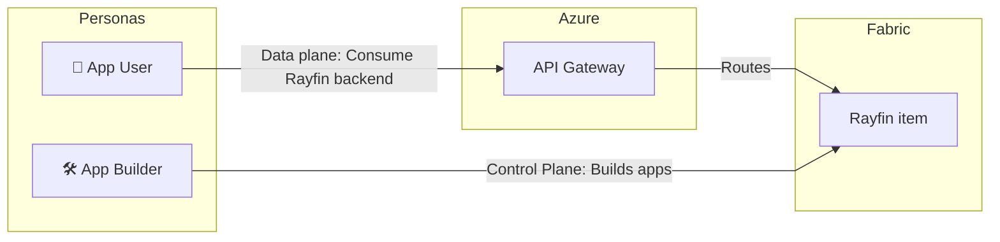
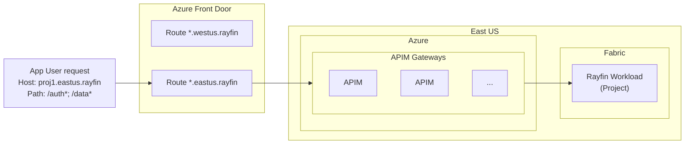
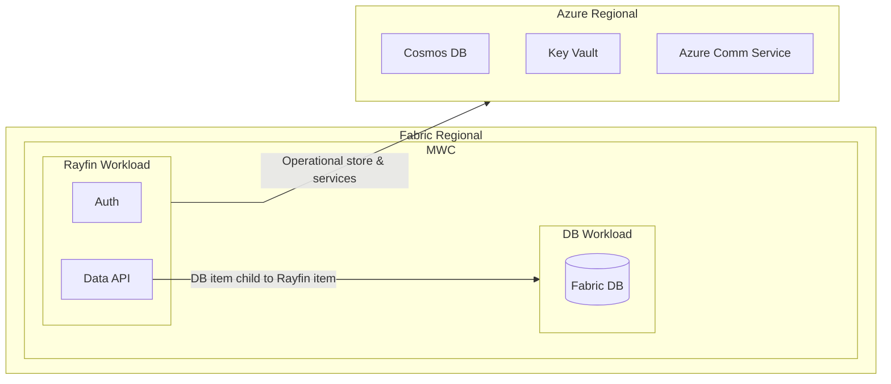
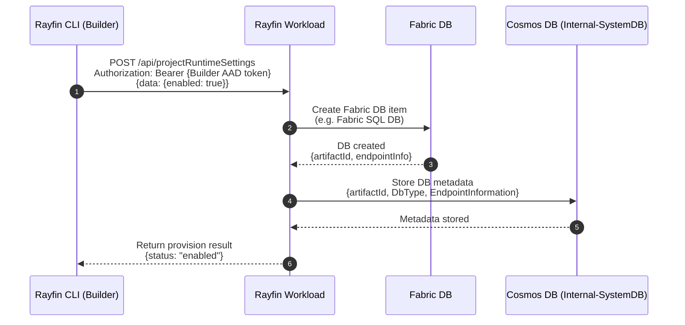
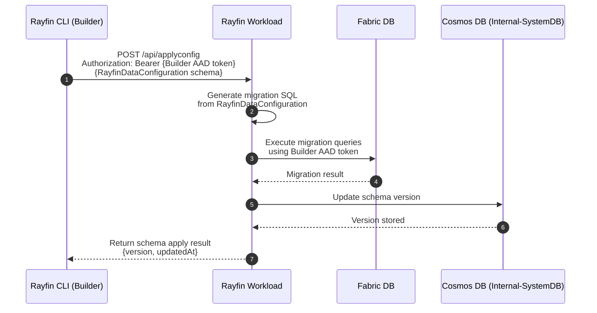
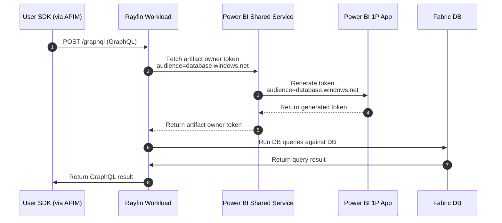
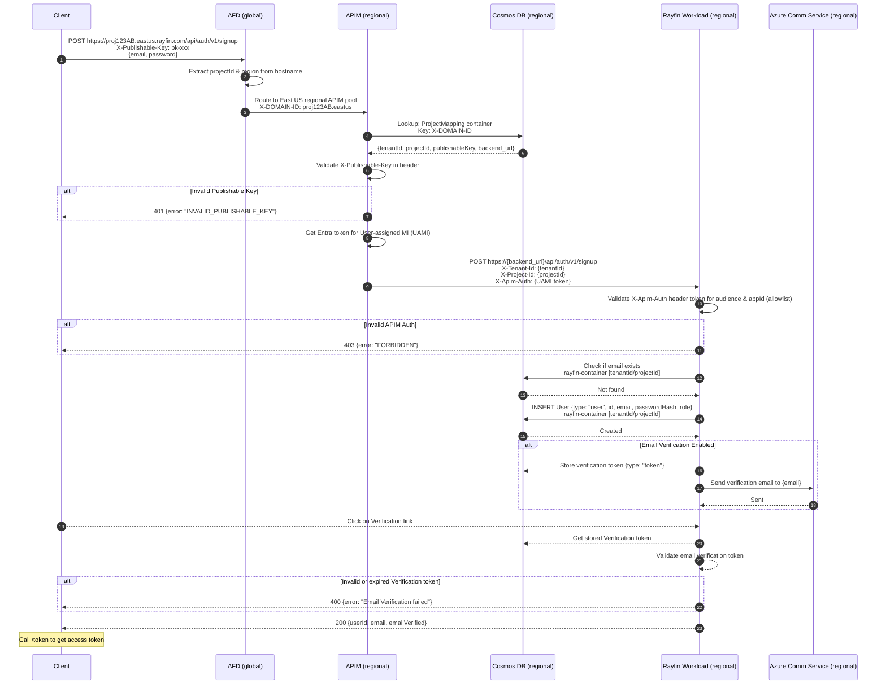
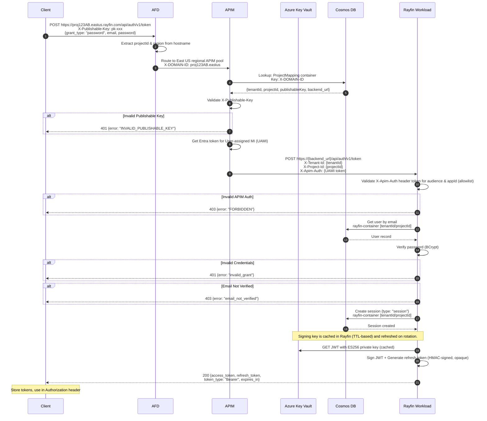
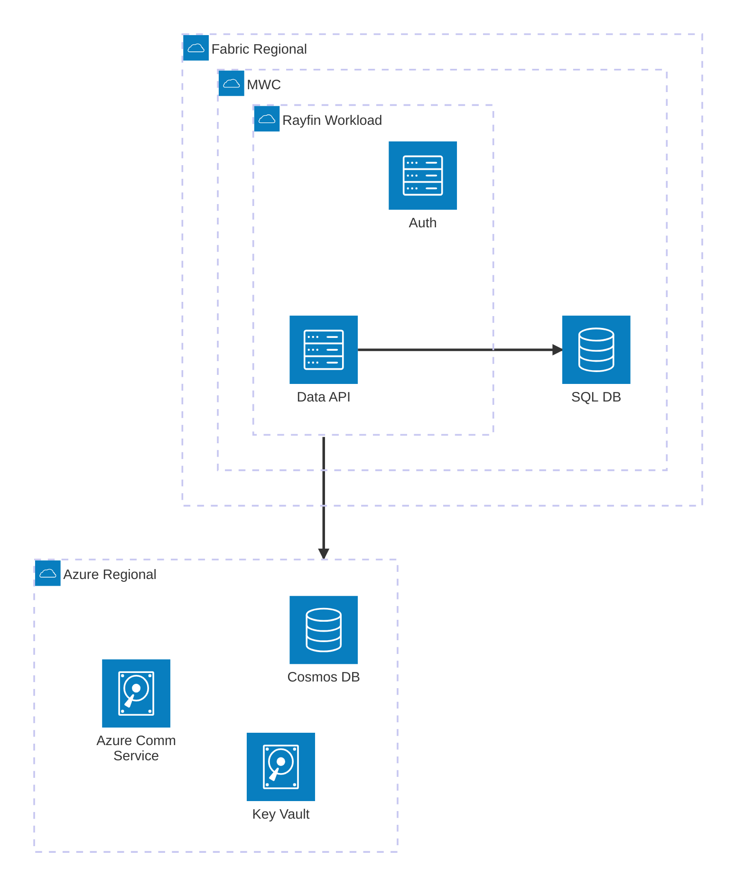

# Rayfin Fabric Architecture

> **Owner:** App Platform Team
> **Last Reviewed:** 2026-01
> **Doc Type:** Single-file, drill-down architecture (Mermaid + anchors)

## Contents

- [Rayfin Fabric Architecture](#rayfin-fabric-architecture)
  - [Contents](#contents)
  - [High-Level Overview](#high-level-overview)
  - [Rayfin item layout in workspace](#rayfin-item-layout-in-workspace)
  - [Gateway](#gateway)
  - [Rayfin Workload architecture](#rayfin-workload-architecture)
    - [Internal Auth](#internal-auth)
    - [Workflows](#workflows)
      - [Data API flow](#data-api-flow)
        - [Summary](#summary)
        - [DB Provision Workflow](#db-provision-workflow)
        - [Data API Schema Workflow](#data-api-schema-workflow)
        - [Data API Query Workflow](#data-api-query-workflow)
    - [Auth Request flows](#auth-request-flows)
      - [Sign up (Email-based)](#sign-up-email-based)
      - [Sign In (Email)](#sign-in-email)
  - [Additional considerations](#additional-considerations)
  - [Glossary](#glossary)
  - [Appendix](#appendix)

---

This doc covers a high-level overview of hosting Rayfin services on Fabric.
Project Rayfin provides backend-as-a-service for application developers. Refer to [Product Definition](../prd/rayfin-product-definition.md) for functional details.

## High-Level Overview

The following diagram highlights how the personas will interact with the Fabric Rayfin item at a high-level.
Complementing the local development setup for a Rayfin project, app builders will be able to productionize their rayfin app and its capabilities on Fabric. Rayfin item (currently named as AppBackend in ArtifactRegistry) is a new Fabric item type that app builders can manage. The item will provide an endpoint with APIs that the app builders can consume in their frontend apps.



  Jump to: [Gateway](#gateway) | [Fabric](#rayfin-workload-architecture).

  Note: Some Markdown Mermaid preview renderers do not support in-diagram navigation.
  Use the links above if clicking nodes does not scroll.

## Rayfin item layout in workspace

The App builder can choose which capabilities they want to enable (DataApi, storage, etc.). To support these capabilities, Fabric SQL database, lakehouse, and so on will be provisioned with a parent-child relationship from Rayfin item.

```text

Workspace
  |
  |____ Rayfin item
          |__ SQL DB (Child)
          |__ Lakehouse (Child)
          |__ ...

```

## Gateway



Jump to: [Overview](#high-level-overview) | [Rayfin Workload architecture](#rayfin-workload-architecture).

## Rayfin Workload architecture

The rayfin items will be managed through a new workload.
- Rayfin Workload will use a regional Cosmos NoSQL instance as its metadatastore.
- A regional Azure KeyVault will be used to store the certificates needed for token signing for Auth capability
- A regional Azure Communication service will be used for sending email notifications for auth capabilities (e.g. email verification, magic link)
- All of these infra resources are expected to be provisioned once using TIPS as part of region buildout and referenced in the workload during startup.
- Network security can be configured to ensure access to these resources is only allowed from workload or MWC nodes.



### Internal Auth

**Infra services**

Rayfin workload will leverage resources such as Azure Cosmos and Azure Communication Service, as mentioned earlier. Rayfin workload will use its workload identity - the corresponding service principal will be authorized on these resources so that the workload can communicate with them.

**Child items**

Rayfin workload supports several workflows. Let's consider the workflows relevant to data api feature.

Control plane/App builder workflows:
- Create Fabric SQL Database as a child item (via Fabric public API)
- Manage schema of the database (via T-SQL calls)

Data plane/App user workflows:
- GraphQL queries translating to SQL queries over database (via T-SQL calls)

For control plane workflows, the expectation is to apply OBO (On-Behalf-Of) flow to the incoming token and thus call Shared or database on behalf of the user.

Data plane workflows are invoked by app users that are not on AAD. The calls to the database (child item) during the workflow should thus happen on an identity set on the item. In case the item identity feature is not available, we can leverage the artifact owner token. Note that the artifact owner token approach is on the path to deprecation and is intended to be a stop-gap solution until the item identity feature is available; we will need to account for a transition plan.

Irrespective of the identity used, the following checks should be enforced before fetching the credentials:
- End-user is authenticated (over Rayfin token)
- End-user has appropriate permissions to invoke queries or mutations. The permissions are set by the item owners when defining the data model.

## Workflows

### Data API flow

Rayfin's Data Experience provides a TypeScript-first, code-driven approach to database and API management. Frontend developers define data models using familiar TypeScript decorators, and Rayfin automatically generates the database schema, GraphQL APIs, and type-safe client code.

#### Summary

Data API consists of three major components:

1. **DB Provision Workflow** - Triggered when the capability is enabled via `/api/projectRuntimeSettings` endpoint.
   Creates a Fabric DB item (e.g., Fabric SQL DB) as a child of the Rayfin item.
   Stores database metadata (artifactId, DbType, EndpointInformation) in the internal SystemDB for later use by schema and query workflows.

1. **Schema Workflow** - `/api/applyconfig` endpoint.
   Applies entity definitions from the Rayfin CLI to the Fabric DB.
   Generates migration SQL from RayfinDataConfiguration and executes against the database using the Builder's AAD token.
   Tracks schema versions to support incremental migrations.

1. **Query Workflow** - `/graphql` endpoint.
   Executes GraphQL queries against the Fabric DB on behalf of App Users.
   Uses artifact owner token (fetched via Power BI Shared Service) for database authentication, not the user's token.
   Leverages DAB GraphQL middleware for query parsing, authorization, and execution.

##### DB Provision Workflow

The DB provision workflow creates a Fabric DB item when the capability is enabled. The initial actor is the Builder using the Rayfin CLI.



##### Data API Schema Workflow

The schema workflow applies entity definitions from the Rayfin CLI to the Fabric DB.
The initial actor is the Builder using the Rayfin CLI, and authentication uses the Builder's AAD token.



##### Data API Query Workflow

The query workflow executes GraphQL queries against the Fabric DB on behalf of App Users.
The authentication uses artifact owner token (fetched via Power BI Shared Service) rather than the user's token.



**Key Design Points:**

- **Multi-dialect support**: Data API supports multiple database flavors (MSSQL and PostgreSQL) through a provider abstraction layer.
  Each dialect has its own connection provider and migration SQL generator.
- **Control plane vs data plane authentication**: Schema and provision workflows (control plane) use the Builder's AAD token.
  Query workflows (data plane) use artifact owner token fetched via Power BI Shared Service, isolating App User requests from Builder credentials.
- **DAB GraphQL middleware**: Query execution leverages Data API Builder (DAB) for GraphQL parsing, authorization policies (RLS/CLS), and database query generation.
- **Schema versioning**: Each schema apply increments a version stored in SystemDB.
  Query workflow validates cached metadata against the active schema version and regenerates if stale.
- **Metadata caching**: GraphQL metadata (schema, DAB config) is cached per tenant/project to avoid regeneration on every request.
  Proactive refresh ensures cache stays warm while minimizing latency.

### Auth Request flows

#### Sign up (Email-based)

The sign-up flow creates a new user account.
After successful sign-up, the client must call the `/token` endpoint to obtain an access token (OAuth 2.1 compliant design).



**Key Design Points:**

- **Hostname-based routing**: AFD extracts domain from `{projectId}.{region}.rayfin.com` and sends `X-DOMAIN-ID` header
- **DomainMapping container**: APIM queries by `X-DOMAIN-ID` to retrieve tenantId, projectId, publishableKey, and backend URL
- **Publishable key validation at APIM**: Gateway validates `X-Publishable-Key` before proxying to backend. Potential throttling limits could be applied here.
- **APIM-to-backend authentication**: APIM reads secret from Key Vault (cached), sends as `X-Apim-Secret`; backend middleware validates
- **Single container design**: All entities (Users, Sessions, Tokens) in `rayfin-container` with tenantId/projectId partition keys
- **Email via ACS**: Verification emails sent through Azure Communication Service (or external SMTP)
- **No token on sign-up**: OAuth 2.1 compliant - sign-up creates account only

#### Sign In (Email)

The sign-in flow authenticates a registered user and issues JWT access and refresh tokens using OAuth 2.1 password grant for email auth.



**Authentication Headers:**

- **X-Publishable-Key**: Required for all data-plane API calls (auth, data)
  - Validated at APIM layer using project metadata from Cosmos DB
- **Authorization: Bearer {access_token}**: Required for authenticated endpoints after sign-in

**Token Details:**

- **Public Key Distribution**: JWKS endpoint at `proj123AB.eastus.rayfin.com/api/.well-known/jwks.json` (no publishable key required)

Jump to: [Gateway](#gateway) | [Overview](#high-level-overview).

## Additional considerations

- Could Docker Desktop "Enterprise" be a hindrance in adoption since it is a requirement for local development?
- For operational data store, CosmosDB in our case, should we be looking at more than one DB per region?
- Avoid MWC FE altogether by having the incoming request from APIM land on the workload This will avoid creating bottleneck on FE. Things to NOTE will be how to handle moniker based routing + capacity throttling. This could be an iterative improvement as well, as this endpoint is hidden from user.
- Build protection against someone spamming APIM + CosmosDB with incorrect projectIds to resolve. One suggestion was to leverage the publishable key here by making it a signed string composed from projectId and validate first if the projectId passed in matches that in the Publishable key.
- Add more defense by putting networking checks on incoming requests to the workload if they are coming from APIM only

## Glossary

TBD.

## Appendix


