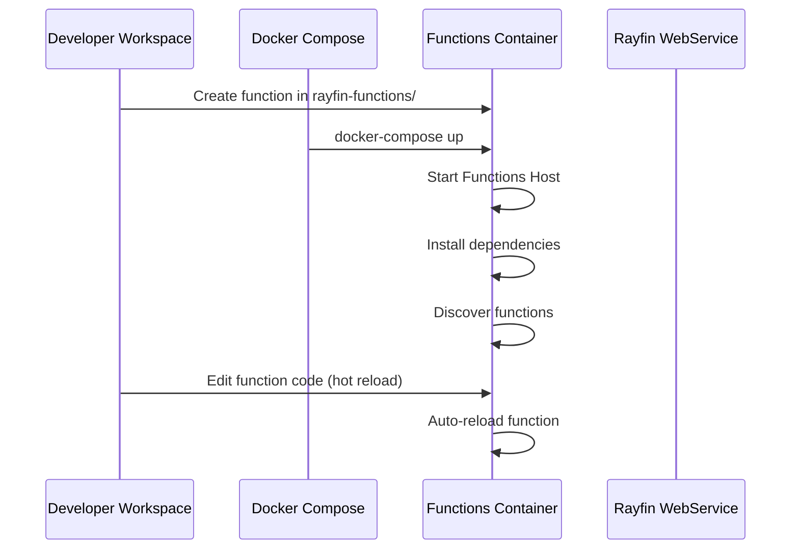
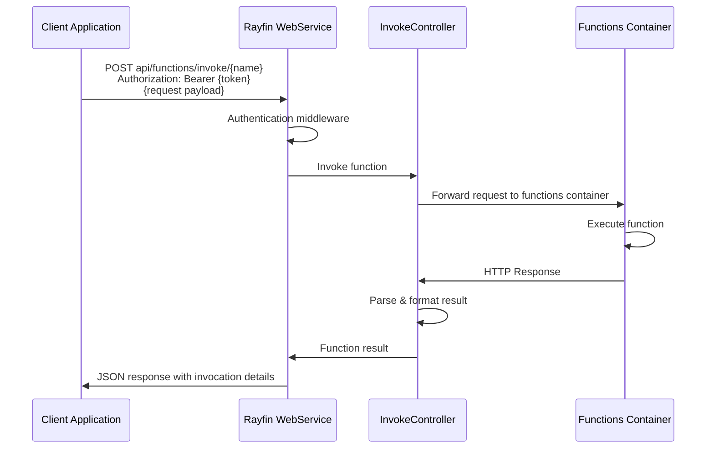
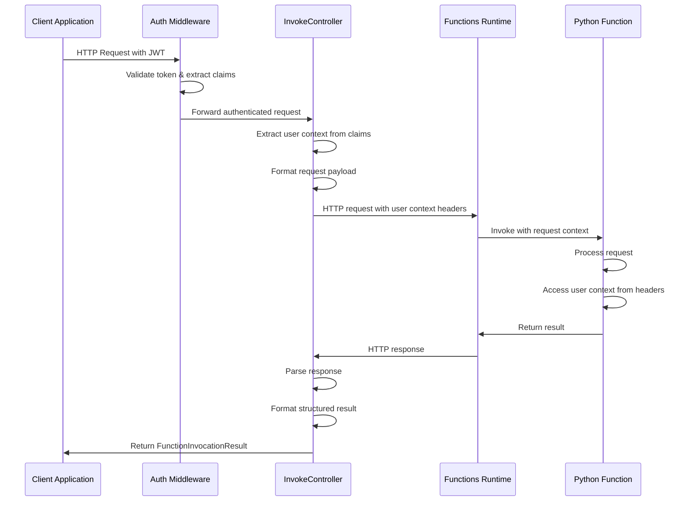

# Rayfin Functions Architecture

This document outlines the architecture and workflow of the Rayfin Functions system, which provides serverless function capabilities integrated with the Rayfin platform. This architecture leverages the Azure Functions runtime in Docker containers while providing a seamless development, deployment, and invocation experience.

For the programming model, this leverages [Fabric's User Data Functions SDK](<(https://learn.microsoft.com/en-us/fabric/data-engineering/user-data-functions/python-programming-model)>) to make extremely simple to author python based functions.

## Overview

Rayfin Functions is a serverless compute environment that allows developers to write and execute code without managing infrastructure. The architecture combines several key components:

1. **Azure Functions Python Runtime in Docker**: The core execution environment based on the official Azure Functions Python Docker image
2. **Fabric User Data Functions SDK**: Tools and utilities for developing functions
3. **Rayfin WebService Proxy**: An authenticated API endpoint that securely invokes functions
4. **Docker Compose Integration**: Development environment setup that connects all components

This design provides several benefits:

1. **Secure Function Invocation**: All function calls are authenticated and authorized through the Rayfin WebService
2. **Unified Development Experience**: Functions run alongside other Rayfin services in the same Docker network
3. **Simplified Deployment**: Functions can be versioned and deployed alongside the main application
4. **Language Flexibility**: Support for Python with plans to extend to other languages

## Core Components

### 1. Docker Container Architecture

The Rayfin Functions container is based on the official Azure Functions Python runtime image, with customizations to integrate with the Rayfin platform:

```yaml
rayfin-functions:
  image: mcr.microsoft.com/azure-functions/python:4
  environment:
    - AzureWebJobsStorage=UseDevelopmentStorage=true
    - FUNCTIONS_WORKER_RUNTIME=python
    - ASPNETCORE_ENVIRONMENT=Development
    - AZURE_FUNCTIONS_ENVIRONMENT=Development
    - HOME=/root
  volumes:
    - ./rayfin-functions:/home/site/wwwroot
  entrypoint: "/bin/bash -c 'cd /home/site/wwwroot && pip install -r requirements.txt && /azure-functions-host/Microsoft.Azure.WebJobs.Script.WebHost'"
  networks:
    - rayfin-network
```

Key aspects of the container configuration:

- The container mounts the local `rayfin-functions` directory to enable real-time code editing
- A custom entrypoint ensures Python dependencies are installed on container start
- The container shares the same network with the Rayfin WebService for secure communication

### 2. Function Development Model

Functions in the Rayfin platform follow a structured development model:

```text
rayfin-functions/
├── host.json            # Functions host
├── local.settings.json  # Local settings and
├── requirements.txt     # Python dependencies
├── function_app.py      # All functions are defined here
```

A typical Rayfin function follows this pattern:

```python
import datetime
import fabric.functions as fn
import logging

udf = fn.UserDataFunctions()

@udf.function()
def hello_fabric(name: str) -> str:
    logging.info('Python UDF trigger function processed a request.')
    logging.info('Executing hello fabric function.')

    return f"Welcome to Fabric Functions, {name}, at {datetime.datetime.now()}!"
```

### 3. Secure Invocation Architecture

The Rayfin WebService provides a secure proxy for function invocation through the `InvokeController`:

```csharp
[ApiController]
[Route("api/functions")]
public class InvokeController : ControllerBase
{
    // Protected endpoint - requires authentication by default
    [HttpPost("invoke/{functionName}")]
    public async Task<IActionResult> InvokeFunction(string functionName, [FromBody] object request)
    {
        // Forward user context to function via HTTP headers
        client.DefaultRequestHeaders.Add("X-Rayfin-User-Id", User.GetUserId());
        client.DefaultRequestHeaders.Add("X-Rayfin-User-Email", User.GetEmail());
        client.DefaultRequestHeaders.Add("X-Rayfin-User-Role", User.GetRole());

        // Invoke function and return structured result
        // ...
    }
}
```

The invocation result follows a standardized format:

```json
{
  "functionName": "hello_fabric",
  "invocationId": "c8b2f3a7-4c3d-45a6-9d8e-1f2c3b4a5d6e",
  "status": "Success",
  "output": {
    "message": "Welcome to Fabric Functions, User, at 2025-07-03T14:30:00Z"
  },
  "errors": []
}
```

Key security aspects:

- Function invocation requires authentication (inherited from the secure-by-default model)
- User context is securely passed to functions for authorization
- Functions can't be directly invoked outside the Rayfin network
- Response format includes invocation metadata for auditing

### 4. Configuration and Options Pattern

The Rayfin Functions integration uses the ASP.NET Core Options pattern for configuration:

```csharp
// Configuration model
public class RayfinFunctionsOptions
{
    public const string SectionName = "RayfinFunctions";
    public string Host { get; set; } = "functions";
    public string Port { get; set; } = "80";
}

// Registration in Program.cs
builder.Services.Configure<RayfinFunctionsOptions>(
    builder.Configuration.GetSection(RayfinFunctionsOptions.SectionName));

// Usage in InvokeController
public InvokeController(IOptions<RayfinFunctionsOptions> functionsOptions)
{
    _functionsOptions = functionsOptions.Value;
}
```

## Sequence Diagrams

### Function Development and Deployment Flow



### Function Invocation Flow



### Detailed Function Execution Flow



This detailed flow illustrates how user context is preserved throughout the request lifecycle, from initial authentication through function execution and back to the client.

## Security Considerations

### Authentication and Authorization

The Rayfin Functions architecture inherits the secure-by-default approach from the Rayfin WebService:

1. **Secure Proxy**: Functions can only be invoked through the authenticated `InvokeController`
2. **User Context Propagation**: User identity is passed to functions via HTTP headers
3. **Network Isolation**: Functions container is only accessible within the Docker network
4. **Authorization in Functions**: Functions can implement additional authorization logic based on user context

### Network Isolation Implementation

1. **Docker Network Isolation**: In the Docker Compose configuration, all services are placed in a private `rayfin-network` with the bridge driver:

   ```yaml
   networks:
     rayfin-network:
       driver: bridge
   ```

   Each service is explicitly connected to this network:

   ```yaml
   networks:
     - rayfin-network
   ```

   This creates a private, isolated network segment that's only accessible to containers within the same Docker Compose deployment.

2. **Proxy-Only Access Pattern**: The Functions container doesn't expose its API endpoints directly to external networks. Instead:
   - The Rayfin WebService acts as the sole authorized proxy to the Functions runtime
   - External clients can only invoke functions through the authenticated WebService API

3. **Hostname Resolution**: Within the Docker network, services refer to each other by their service names, not by localhost or external IPs:

   ```csharp
   // RayfinFunctionsOptions default configuration
   public string Host { get; set; } = "rayfin-functions";
   ```

   The hostname `rayfin-functions` is only resolvable within the Docker network, preventing external systems from directly accessing it.

4. **Port Exposure Control**: While the Functions container exposes port 80 internally, it's mapped to the host's port 7071 only for development purposes:

   ```yaml
   rayfin-functions-local:
     ports:
       - '7071:80'
   ```

   In production deployments, this port mapping would be removed to prevent any direct external access.

This multi-layered approach ensures that function invocation must go through the secure, authenticated Rayfin WebService proxy, maintaining the security boundary even if the development ports are exposed.

## Deployment Models

### 1. Development Environment

In the development environment, functions are mounted directly from the developer's filesystem:

```yaml
volumes:
  - ./rayfin-functions:/home/site/wwwroot
```

This allows for:

- Real-time editing and hot reloading
- Quick iteration and testing
- Direct access to function logs

### 2. Production Deployment

For production, functions can be deployed using several approaches:

1. **Container Image with Embedded Functions**:
   - Functions are copied into the image during build
   - Image is versioned and deployed as a unit
   - Provides immutable, reproducible deployments

2. **External Volume Mount**:
   - Functions are stored on a shared volume
   - Multiple instances can access the same function code
   - Enables updating functions without rebuilding containers

3. **External Azure Functions**:
   - Functions are deployed to Azure Functions service
   - Rayfin WebService acts as a secure proxy
   - Leverages managed scaling and monitoring

## Future Enhancements

Planned enhancements to the Rayfin Functions architecture include:

1. **Additional Language Support**: Adding Node.js
2. **Function Versioning**: Supporting multiple versions of functions
3. **Enhanced Security**: Adding function-level authorization policies
4. **Scaling**: Support for distributed function execution
5. **Local Development Tooling**: CLI for function creation and testing

## Conclusion

The Rayfin Functions architecture provides a flexible, secure, and integrated approach to serverless computing within the Rayfin platform. By leveraging Docker containers, the Azure Functions runtime, and a secure proxy pattern, it enables developers to build powerful event-driven applications while maintaining the security and consistency of the overall platform.

## Implementation Notes

### Controller Endpoints

The `InvokeController` currently implements a POST endpoint for function invocation:

```csharp
[HttpPost("invoke/{functionName}")]
public async Task<IActionResult> InvokeFunction(string functionName, [FromBody] object request)
```
