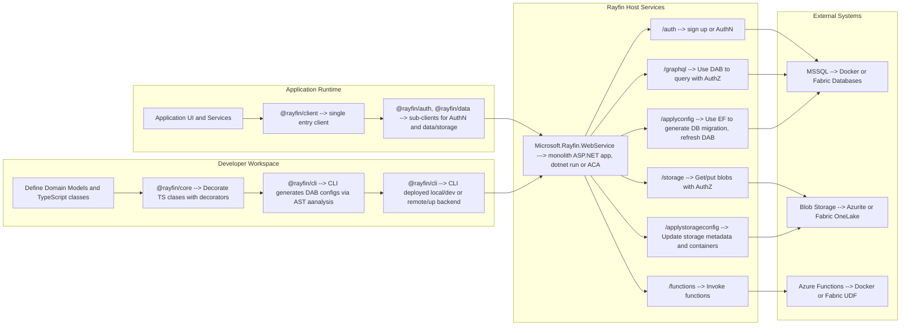

# Project Rayfin PoC Architecture Overview

This document provides a high-level view of the Rayfin PoC including the configuration stack and the web service stack, with the major data flows between components.

> The Rayfin PoC is essentially a collection of NPM packages and a monolith Web API (which itself depends on a SQL Server, storage, etc.)

## Big Picture

## Stacks

### Configuration Stack

- Define models using plain TypeScript classes.
- Decorate classes using decorators from `@rayfin/core`.
- Generate configuration with the Rayfin CLI and apply to Rayfin WebService
  - DAB+ configuration file (DAB compliant + some additional metadata)
  - Storage configuration file (independent of DAB)
- Apply the DB configuration
  - Uses Entity Framework to migrate DB to scehma defined in DAB+
  - Restarts DAB server
- Apply storage config
  - Updates requires storage metadata and containers

### Web Service and Client Stack

- All CLI & client traffic goes to `Microsoft.Rayfin.WebService`, which acts as an API gateway.
- `@rayfin/data` provides 100% DAB-compliant interfaces (REST, GraphQL fluent, raw GraphQL) but calls the WebService, not DAB directly.
- The WebService proxies data operations to DAB and handles storage operations directly against the storage backend.
- `@rayfin/lib` provides the shared `ApiClient` handling authentication, retries, timeouts, and error mapping.
- The WebService reuses shared libraries from `Microsoft.Rayfin.Common` and centralizes authentication and policy enforcement.
- The CLI apply/generate operations also call the WebService for applying configuration so that the service manages DAB configuration lifecycle.
- < Incomplete info on Rayin Functions; dropped from poc scope for now. >

## Major Data Flows

1. Code-first configuration.
   Developers define entities and decorate them with `@rayfin/core`.
   The CLI reads decorators and generates configurations that is applied to the WebService.

2. Application data access.
   Frontend or service code creates an `ApiClient` from `@rayfin/lib` and a `DataApi` from `@rayfin/data`.
   All requests go to the WebService which proxies data calls to DAB and DAB forwards queries to the configured SQL database.

3. Storage file operations.
   Applications use `StorageApi` from `@rayfin/data` to upload, download, and list objects.
   All storage calls are sent to the WebService which performs validation, maps errors, and executes blob operations against the configured storage account.
   The storage account is used only as the backend for blob and file operations and is not accessed directly by clients.

4. Authentication and authorization.
   Requests carry tokens handled by the `ApiClient`.
   The WebService validates identity and permissions and DAB enforces entity-level permissions as generated from decorators.
   There is no external identity provider in the current architecture.

5. Server-side functions.
   The WebService Proxies function invocations if authorized. < Incomplete info on Rayin Functions; dropped from poc scope for now. >
