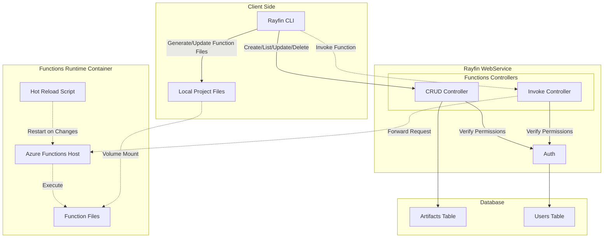
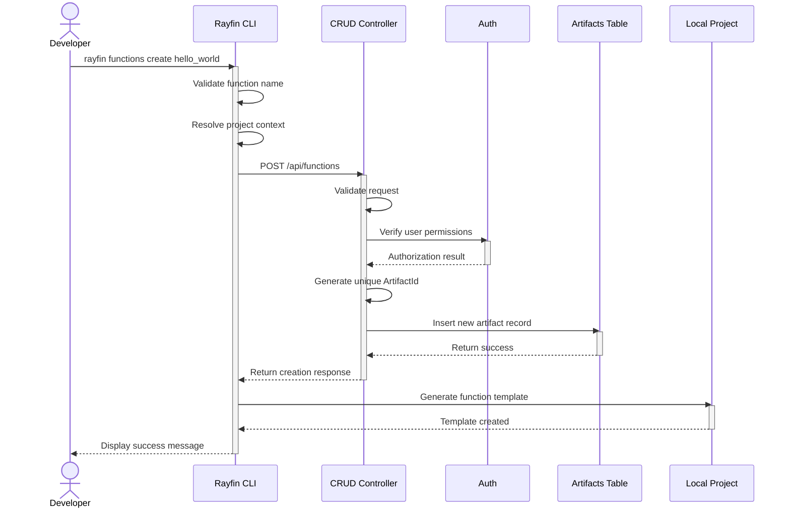
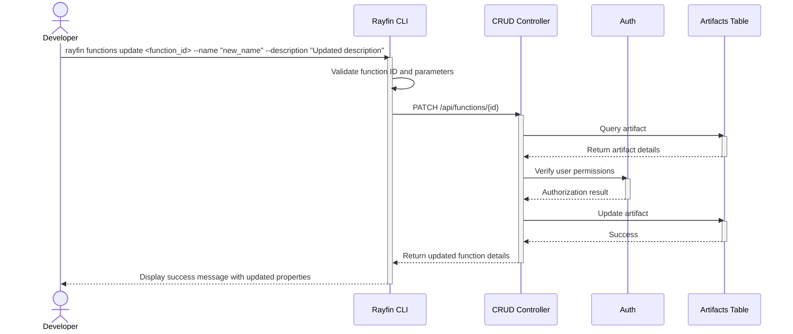
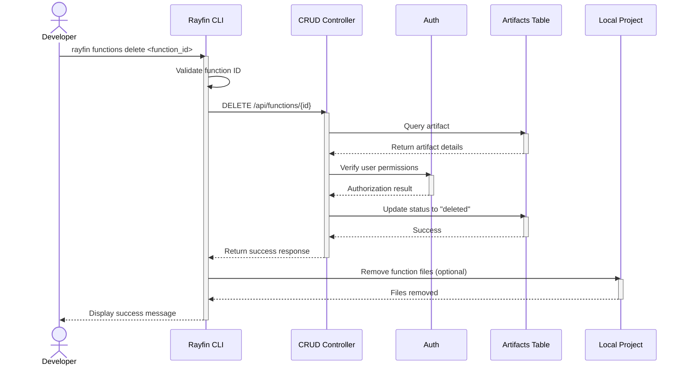
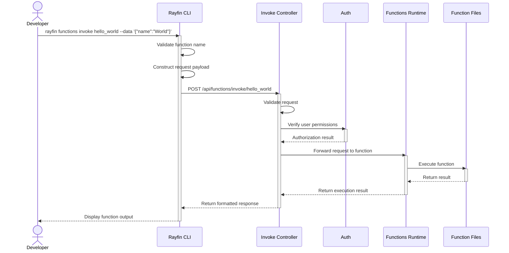

# RFC: Rayfin Functions Management System

**Status**: Draft
**Date**: July 5, 2025
**Version**: 0.1

## 1. Overview

This RFC proposes extending the Rayfin Functions system to include a comprehensive management solution for function artifacts. The goal is to enhance the developer experience by providing CLI commands to create, list, and delete functions, while maintaining a centralized database record of all function artifacts.

## 2. Motivation

Currently, Rayfin Functions provides the ability to execute Python-based serverless functions within the Rayfin ecosystem. While the hot-reloading and auto-discovery mechanisms for functions are already implemented via Docker images and custom scripts, there's no structured way to manage function artifacts from a project and user perspective.

The proposed extension will:

1. Enable tracking of function ownership and metadata
2. Provide a consistent CLI interface for function lifecycle management
3. Support multi-user and multi-project scenarios
4. Lay groundwork for future function versioning and access control features

## 3. Proposed Solution

### 3.1 Core Components

**Architecture Diagram**:



The proposed solution consists of the following core components:

1. **Database Schema**: A new `Artifacts` table to track function metadata
2. **Functions Controllers**: CRUD and Invoke controllers for function lifecycle management
3. **Auth Layer**: Common authentication and authorization layer for all controllers
4. **CLI Commands**: Extensions to the Rayfin CLI for function management

### 3.2 Database Schema

The `Artifacts` table will track all function artifacts with the following schema:

```sql
CREATE TABLE [dbo].[Artifacts] (
    [Id] UNIQUEIDENTIFIER PRIMARY KEY DEFAULT NEWID(),
    [ArtifactId] NVARCHAR(128) NOT NULL,
    [ProjectName] NVARCHAR(255) NOT NULL,
    [ArtifactType] NVARCHAR(50) NOT NULL,
    [Name] NVARCHAR(255) NOT NULL,
    [UserId] UNIQUEIDENTIFIER NOT NULL,
    [CreatedAt] DATETIME2 NOT NULL DEFAULT GETUTCDATE(),
    [UpdatedAt] DATETIME2 NOT NULL DEFAULT GETUTCDATE(),
    [Description] NVARCHAR(MAX) NULL,
    [Status] NVARCHAR(50) NOT NULL DEFAULT 'active',
    [Metadata] NVARCHAR(MAX) NULL,
    CONSTRAINT [UQ_Artifacts_ArtifactId] UNIQUE ([ArtifactId]),
    CONSTRAINT [FK_Artifacts_Users] FOREIGN KEY ([UserId]) REFERENCES [dbo].[Users] ([Id])
);

CREATE INDEX [IX_Artifacts_ProjectName] ON [dbo].[Artifacts] ([ProjectName]);
CREATE INDEX [IX_Artifacts_UserId] ON [dbo].[Artifacts] ([UserId]);
CREATE INDEX [IX_Artifacts_ArtifactType] ON [dbo].[Artifacts] ([ArtifactType]);
```

### 3.3 WebService API

The Rayfin WebService will have the following components:

1. **Functions Controllers**
   - **CRUD Controller** - Manages function lifecycle (create, read, update, delete)
   - **Invoke Controller** - Executes functions and returns results

2. **Auth Layer**
   - Common authentication and authorization layer
   - All controllers interact with this layer to verify permissions
   - Manages user identity and project access rights

The following endpoints will be added to the CRUD controller:

1. **Create Function**: `POST /api/functions`
2. **List Functions**: `GET /api/functions`
3. **Get Function Details**: `GET /api/functions/{id}`
4. **Update Function**: `PATCH /api/functions/{id}`
5. **Delete Function**: `DELETE /api/functions/{id}`

### 3.4 CLI Commands

The Rayfin CLI will be extended with the following commands:

```bash
rayfin functions create <function_name> [--project <project_name>] [--description <description>]

rayfin functions list [--project <project_name>]

rayfin functions update <function_id> [--name <new_name>] [--description <new_description>]
[--metadata <json_metadata>]

rayfin functions delete <function_id>

rayfin functions invoke <function_name> [--data <json_data>] [--file <input_file>]
```

## 4. Detailed Design

### 4.1 Function Creation Flow



1. User executes `rayfin functions create hello_world`
2. CLI validates the function name and project context
3. CLI sends request to WebService API
4. WebService creates an entry in the `Artifacts` table
5. WebService generates a unique `ArtifactId`
6. CLI creates a function template in the local project
7. Function is ready for editing and execution

### 4.2 Function Listing Flow

1. User executes `rayfin functions list`
2. CLI sends request to WebService API. Project name/id is expected to be available in JWT.
3. WebService queries the `Artifacts` table with appropriate filters
4. WebService returns a list of functions the user has access to
5. CLI displays the function list with relevant metadata

### 4.3 Function Update Flow



1. User executes `rayfin functions update <function_id> --name "new_name" --description "Updated description"`
2. CLI validates the function ID and update parameters
3. CLI sends update request to WebService API
4. WebService verifies the user has permission to update the function
5. WebService updates the function properties in the database
6. CLI displays the updated function details to the user

### 4.4 Function Deletion Flow



1. User executes `rayfin functions delete <function_id>`
2. CLI validates the function ID
3. CLI sends delete request to WebService API
4. WebService verifies the user has permission to delete the function
5. WebService updates the function status to "deleted" in the database
6. CLI removes the function files from the local project (optional)

### 4.5 Function Invocation Flow



1. User executes `rayfin functions invoke hello_world --data '{"name":"World"}'`
2. CLI validates the function name exists in the project
3. CLI constructs the request payload from the provided data or input file
4. CLI sends request to the `InvokeController` API endpoint
5. WebService validates the request and verifies the user has permission to invoke the function
6. WebService forwards the request to the Functions runtime
7. Functions runtime executes the function code with the provided input
8. WebService receives and processes the response
9. CLI formats and displays the function execution result to the user

### 4.6 Data Models

#### FunctionArtifact

```csharp
public class FunctionArtifact
{
    public Guid Id { get; set; }
    public string ArtifactId { get; set; } = null!;
    public string ProjectName { get; set; } = null!;
    public string ArtifactType { get; set; } = null!;
    public string Name { get; set; } = null!;
    public Guid UserId { get; set; }
    public DateTime CreatedAt { get; set; }
    public DateTime UpdatedAt { get; set; }
    public string? Description { get; set; }
    public string Status { get; set; } = "active";
    public string? Metadata { get; set; }
}
```

#### CreateFunctionRequest

```csharp
public class CreateFunctionRequest
{
    public string Name { get; set; } = null!;
    public string ProjectName { get; set; } = null!;
    public string? Description { get; set; }
    public Dictionary<string, object>? Metadata { get; set; }
}
```

#### UpdateFunctionRequest

```csharp
public class UpdateFunctionRequest
{
    public string? Name { get; set; }
    public string? Description { get; set; }
    public Dictionary<string, object>? Metadata { get; set; }
    // Note: ProjectName cannot be changed after creation
}
```

#### FunctionListResponse

```csharp
public class FunctionListResponse
{
    public List<FunctionSummary> Functions { get; set; } = new();
    public int TotalCount { get; set; }
    public int Page { get; set; }
    public int PageSize { get; set; }
}

public class FunctionSummary
{
    public Guid Id { get; set; }
    public string ArtifactId { get; set; } = null!;
    public string Name { get; set; } = null!;
    public string ProjectName { get; set; } = null!;
    public DateTime CreatedAt { get; set; }
    public string Status { get; set; } = null!;
    public string? Description { get; set; }
}
```

## 5. Implementation Plan

### 5.1 Phase 1: Core Infrastructure

1. Create database migration for the `Artifacts` table
2. Implement WebService API endpoints
3. Add basic authorization and validation
4. Update FunctionsApi.ts

### 5.2 Phase 2: CLI Integration

1. Extend the Rayfin CLI with new commands
2. Implement function template generation
3. Add CLI documentation

## 6. API Specification

### 6.1 Create Function

**Endpoint**: `POST /api/functions`

**Request**:

```json
{
  "name": "hello_world",
  "projectName": "my-project",
  "description": "A simple hello world function",
  "metadata": {
    "runtime": "python",
    "timeout": 30
  }
}
```

**Response**:

```json
{
  "id": "3fa85f64-5717-4562-b3fc-2c963f66afa6",
  "artifactId": "fn_hello_world_3fa85f64",
  "name": "hello_world",
  "projectName": "my-project",
  "createdAt": "2025-07-05T12:00:00Z",
  "status": "active",
  "description": "A simple hello world function"
}
```

### 6.2 List Functions

**Endpoint**: `GET /api/functions?projectName={projectName}&page={page}&pageSize={pageSize}`

**Response**:

```json
{
  "functions": [
    {
      "id": "3fa85f64-5717-4562-b3fc-2c963f66afa6",
      "artifactId": "fn_hello_world_3fa85f64",
      "name": "hello_world",
      "projectName": "my-project",
      "createdAt": "2025-07-05T12:00:00Z",
      "status": "active",
      "description": "A simple hello world function"
    }
  ],
  "totalCount": 1,
  "page": 1,
  "pageSize": 10
}
```

### 6.3 Get Function Details

**Endpoint**: `GET /api/functions/{id}`

**Response**:

```json
{
  "id": "3fa85f64-5717-4562-b3fc-2c963f66afa6",
  "artifactId": "fn_hello_world_3fa85f64",
  "name": "hello_world",
  "projectName": "my-project",
  "artifactType": "function",
  "userId": "1fa85f64-5717-4562-b3fc-2c963f66afa7",
  "createdAt": "2025-07-05T12:00:00Z",
  "updatedAt": "2025-07-05T12:00:00Z",
  "status": "active",
  "description": "A simple hello world function",
  "metadata": {
    "runtime": "python",
    "timeout": 30
  }
}
```

### 6.4 Update Function

**Endpoint**: `PATCH /api/functions/{id}`

**Request**:

```json
{
  "name": "updated_hello_world",
  "description": "An updated hello world function",
  "metadata": {
    "runtime": "python",
    "timeout": 60
  }
}
```

**Response**:

```json
{
  "id": "3fa85f64-5717-4562-b3fc-2c963f66afa6",
  "artifactId": "fn_hello_world_3fa85f64",
  "name": "updated_hello_world",
  "projectName": "my-project",
  "updatedAt": "2025-07-06T12:00:00Z",
  "status": "active",
  "description": "An updated hello world function",
  "metadata": {
    "runtime": "python",
    "timeout": 60
  }
}
```

### 6.5 Delete Function

**Endpoint**: `DELETE /api/functions/{id}`

**Response**:

```json
{
  "id": "3fa85f64-5717-4562-b3fc-2c963f66afa6",
  "status": "deleted"
}
```

### 6.6 Invoke Function

**Endpoint**: `POST /api/functions/invoke/{functionName}`

**Request**: (Any JSON payload required by the function)

```json
{
  "name": "World"
}
```

**Response**:

```json
{
  "functionName": "hello_world",
  "invocationId": "6fa85f64-5717-4562-b3fc-2c963f66afa9",
  "status": "Success",
  "output": {
    "message": "Hello, World!"
  },
  "errors": []
}
```

## 7. Security Considerations

1. **Authentication**: All API endpoints will require authentication
2. **Authorization**: Functions will be scoped to projects and users
3. **Validation**: Input validation for all API requests
4. **Audit Logging**: All function lifecycle events will be logged

## 8. Appendix

### 8.1 Database Migration

```csharp
public partial class AddArtifactsTable : Migration
{
    protected override void Up(MigrationBuilder migrationBuilder)
    {
        migrationBuilder.CreateTable(
            name: "Artifacts",
            columns: table => new
            {
                Id = table.Column<Guid>(nullable: false, defaultValueSql: "NEWID()"),
                ArtifactId = table.Column<string>(maxLength: 128, nullable: false),
                ProjectName = table.Column<string>(maxLength: 255, nullable: false),
                ArtifactType = table.Column<string>(maxLength: 50, nullable: false),
                Name = table.Column<string>(maxLength: 255, nullable: false),
                UserId = table.Column<Guid>(nullable: false),
                CreatedAt = table.Column<DateTime>(nullable: false, defaultValueSql: "GETUTCDATE()"),
                UpdatedAt = table.Column<DateTime>(nullable: false, defaultValueSql: "GETUTCDATE()"),
                Description = table.Column<string>(nullable: true),
                Status = table.Column<string>(maxLength: 50, nullable: false, defaultValue: "active"),
                Metadata = table.Column<string>(nullable: true)
            },
            constraints: table =>
            {
                table.PrimaryKey("PK_Artifacts", x => x.Id);
                table.UniqueConstraint("UQ_Artifacts_ArtifactId", x => x.ArtifactId);
                table.ForeignKey(
                    name: "FK_Artifacts_Users",
                    column: x => x.UserId,
                    principalTable: "Users",
                    principalColumn: "Id",
                    onDelete: ReferentialAction.Cascade);
            });

        migrationBuilder.CreateIndex(
            name: "IX_Artifacts_ProjectName",
            table: "Artifacts",
            column: "ProjectName");

        migrationBuilder.CreateIndex(
            name: "IX_Artifacts_UserId",
            table: "Artifacts",
            column: "UserId");

        migrationBuilder.CreateIndex(
            name: "IX_Artifacts_ArtifactType",
            table: "Artifacts",
            column: "ArtifactType");
    }

    protected override void Down(MigrationBuilder migrationBuilder)
    {
        migrationBuilder.DropTable(
            name: "Artifacts");
    }
}
```
